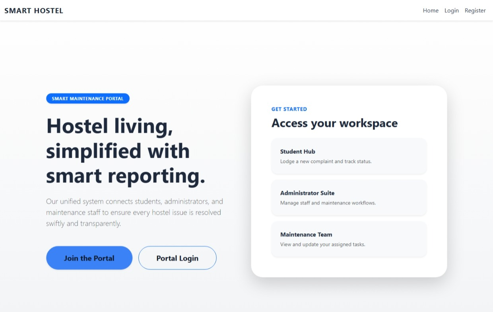
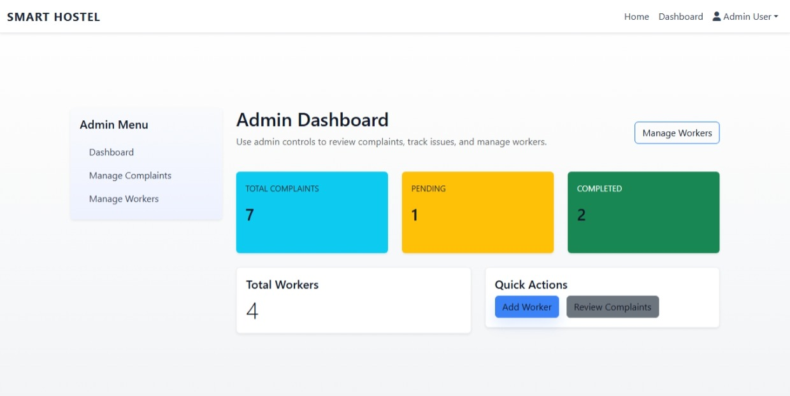
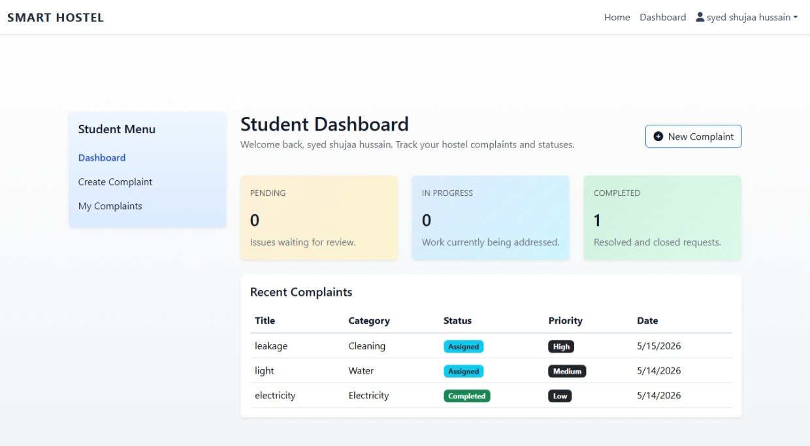
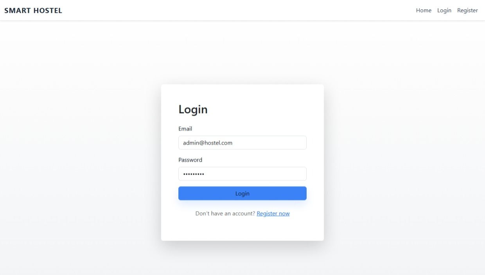
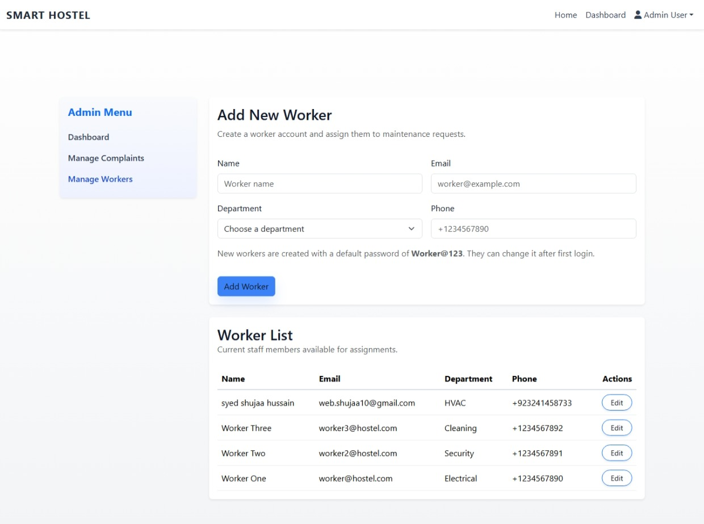
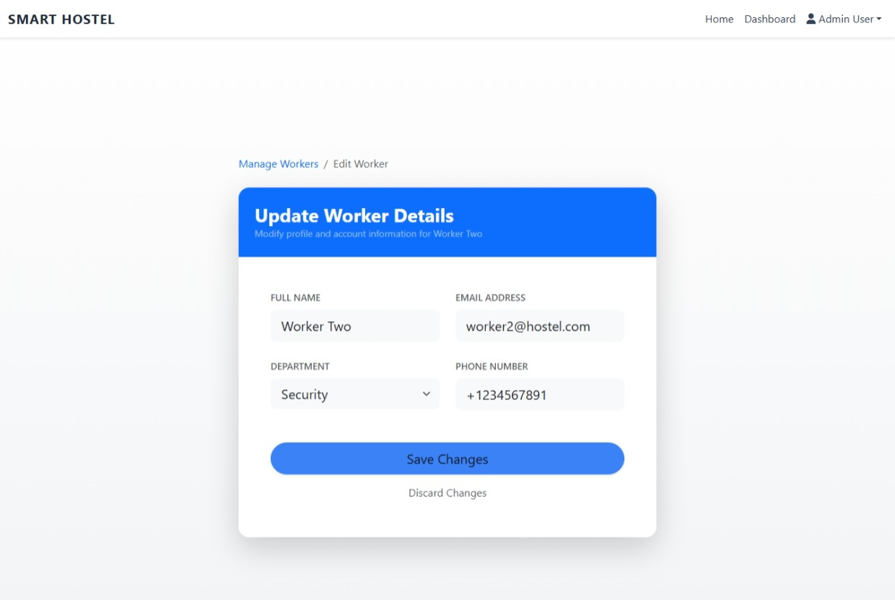
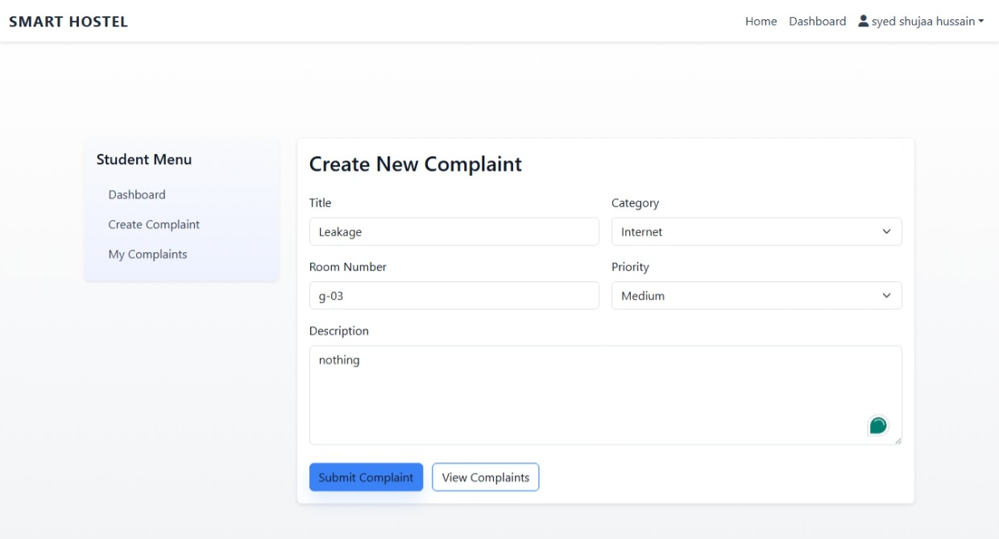
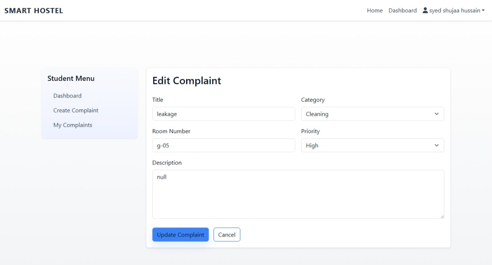

# Smart Hostel Complaint & Maintenance Management System

A modern full-stack hostel complaint management system built with Node.js, Express, EJS, Bootstrap, and MySQL.

## 🛠️ Tech Stack


---

## Features

- Register, Login, Logout
- Role-based access: Student, Admin, Worker
- Student complaint CRUD operations
- Admin complaint management, worker management, assignment, status updates
- Worker dashboard with assigned complaints and progress updates
- Responsive UI with dashboard cards, status badges, and filters
- Secure session authentication and bcrypt password hashing

## Screenshots

Be sure to check the application interface below:














## Project Structure

- `app.js` - main server entry point
- `config/db.js` - MySQL connection pool
- `routes/` - Express routers
- `controllers/` - route handler logic
- `models/` - database queries and CRUD helpers
- `middleware/` - authentication and authorization
- `views/` - EJS templates
- `public/` - CSS and JavaScript assets
- `database/schema.sql` - SQL database schema and sample seed data

## Required Packages

- express
- express-session
- connect-flash
- ejs
- mysql2
- bcryptjs

## Setup Instructions

1. Install dependencies:

```bash
npm install
```

2. Create the MySQL database and tables using MySQL Workbench or command line.

- Open `database/schema.sql` in MySQL Workbench and execute it.
- Or run the SQL directly with a MySQL client.

> Note: `database/schema.sql` is intended for initial setup. Avoid rerunning it after you have added or updated data to prevent duplicate sample inserts and preserve your changes.

3. Update database credentials in `config/db.js` if necessary.

```js
const pool = mysql.createPool({
  host: process.env.DB_HOST || 'localhost',
  user: process.env.DB_USER || 'root',
  password: process.env.DB_PASSWORD || 'your_mysql_password',
  database: process.env.DB_NAME || 'hostel_mgmt',
  waitForConnections: true,
  connectionLimit: 10,
  queueLimit: 0
});
```

If your MySQL root user requires a password, set `DB_PASSWORD` in your environment or replace the empty string with your root password.

4. Start the app:

```bash
npm start
```

5. Open the application in your browser:

```bash
http://localhost:3000
```

## Example Credentials

- Admin: `admin@hostel.com` / `Admin@123`
- Worker: `worker@hostel.com` / `Worker@123`
- Student: `student@hostel.com` / `Student@123`

## Notes

- Use the admin dashboard to add more workers and assign them to complaints.
- Students can create complaints and track status changes.
- Workers can view and update assigned complaints.

- ## License

This project is Created by Syed Shujaa Hussain.
